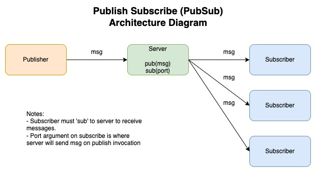

# PubSub

Not to be confused with Publix Subs

### Server
Start the server with
```
node server <sub port> <pub port>
```
Can use default ports 4000 and 4001 with
```
npm run server
```

### Subscriber
Start and subscribe the subscriber with
```
node subscriber <server sub signup port> <this subscriber port>
```
Can use default ports 4000 and 5000 with
```
npm run sub
```

### Publish Message
You can publish a message like so
```
node publisher <pub port> <'message'>
```
Can use default port 4000 and message of MSG with
```
npm run pub
```

### Architecture Diagram



### Other Commands
Tests
```
npm run test
```

Eslint
```
npm run lint
```

### Ideas if infinite time

1) TypeScript
2) multi-channel per server (currently single channel)
3) -v setting for optional detailed logging
4) react front end to sub/pub with server via websockets with something like this: https://www.valentinog.com/blog/socket-react/